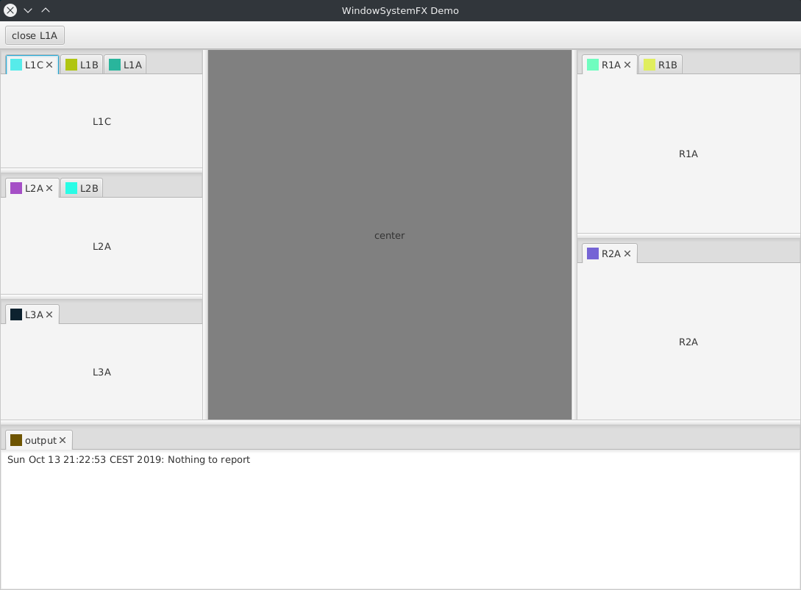

# WindowSystemFX
**A Window System for JavaFX applications inspired by NetBeans Window System**
 

The setup is configured from annotations and by exposing ServiceProviders.
Still pretty early development and much on the todo list such as
- Drag and drop
- Save and restore window states
- Styling
- Undock to Stage
